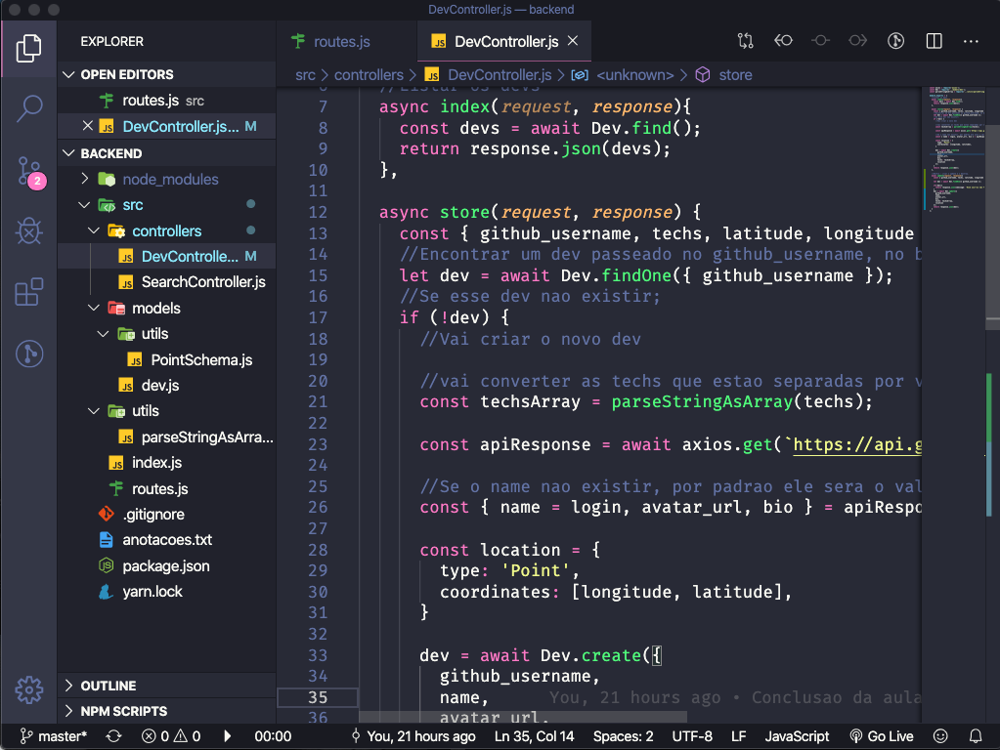
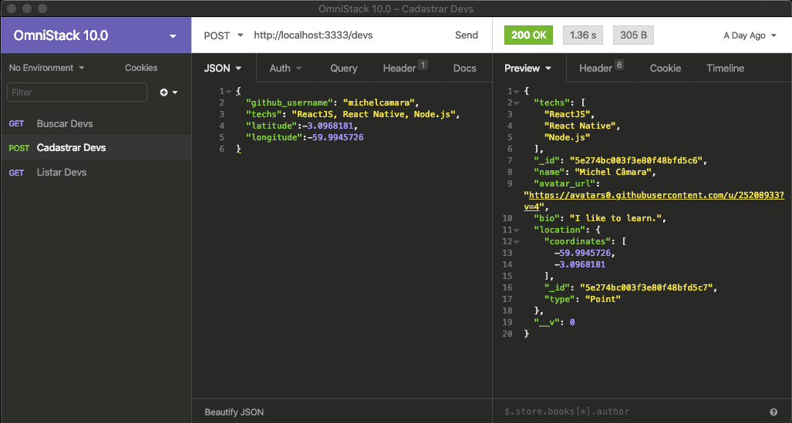
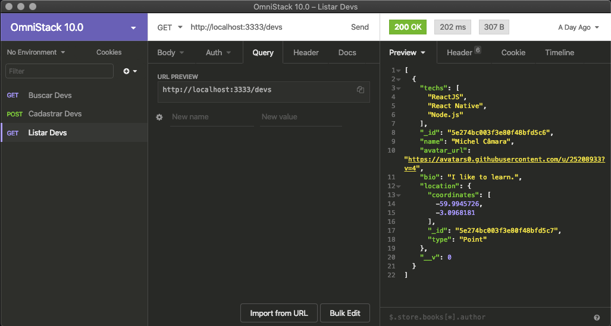
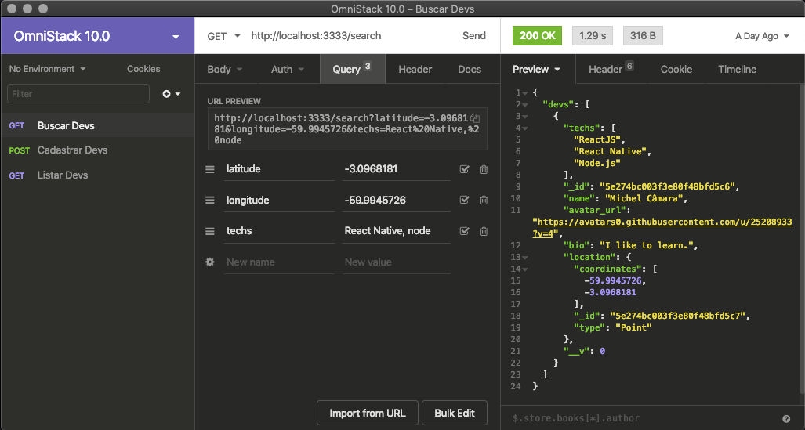

 
# Back-end Node.js
A estrutura lógica do projeto foi implementado com a tecnologia Node.js, mais as bibliotecas suplementares externas:
  1. Express.
  2. Mongoose.
  3. Axios.
  4. Nodemon.
  5. Cors
 Foi posto em prática algumas técnicas atuais para desenvolvimento, por exemplo, Arrow Function, Controller, Model, reutilização de código como componente, etc.

O resultado desse módulo é uma API com rotas, que permite a busca, cadastro e listagem de devs.

#### Softwares para desenvolvimento
Para que pudesse ser possivel o desenvolvimento do projeto back-end, foram usados os seguintes programas:
  1. Mongo Compass - Cliente para o banco Mongo DB.
  2. Insominia - Validador da API.
  3. Visual Code - IDE para escrever os códigos.
