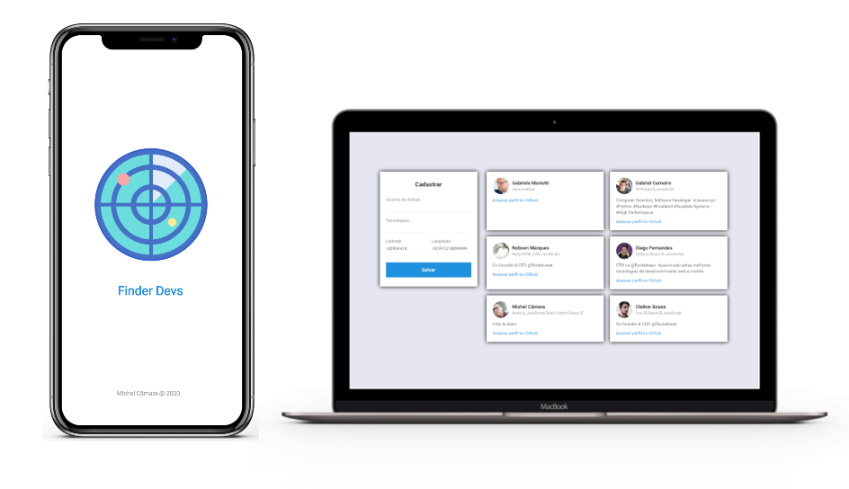
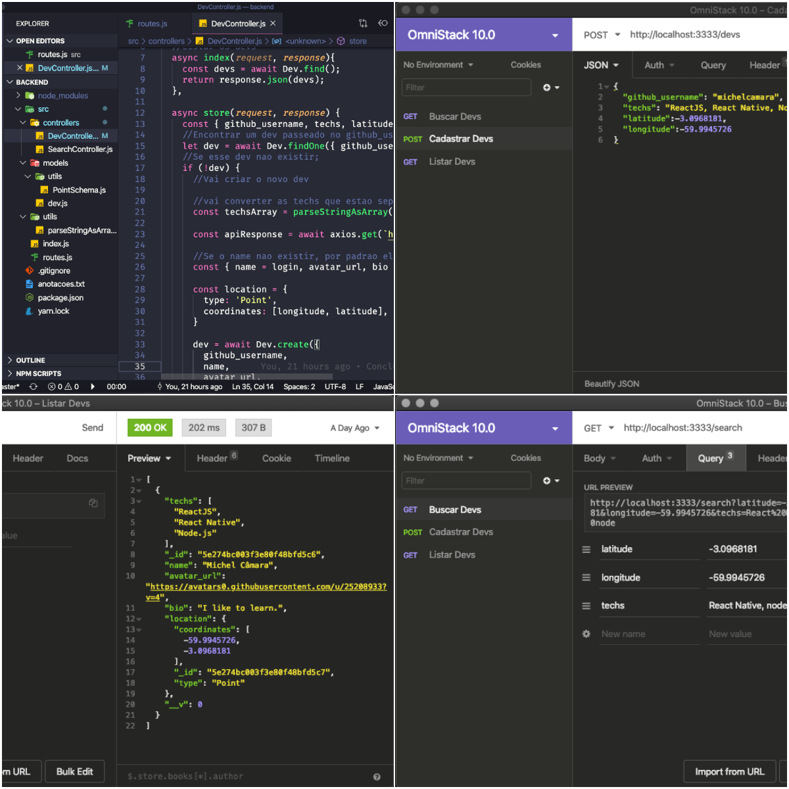
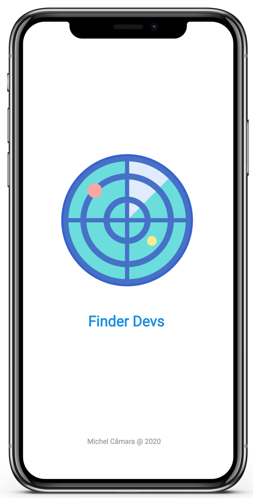

# Sobre

Este projeto é o resultado do aprendizado obtido na semana Omnistack 10.0.
Que possue o objetivo de introduzir o desenvolvedor nas stack javaScript em alta no mercado, Node.js, React JS e React Native.

Esse produto é produzido em três partes:
  1. Back-end - Desenvolvido em Node.js.
  2. Front-end Web - Desenvolvido em React JS.
  3. Front-end Mobile - Desenvolvido em React Native.

## Back-End  Node.js
A estrutura lógica do projeto foi implementado com a tecnologia Node.js, mais as bibliotecas suplementares externas:
  1. Express.
  2. Mongoose.
  3. Axios.
  4. Nodemon.
  5. Cors  
Foi posto em prática algumas técnicas atuais para desenvolvimento, por exemplo, Arrow Function, Controller, Model, reutilização de código como componente, etc.

O resultado dessa parte é uma API com rotas, que permite a busca, cadastro e listagem de devs.

Leia mais sobre este módulo. [Clique aqui](https://github.com/michelcamara/Omnistack10/tree/master/backend)

## Front-End Web ReactJS
`"O React é uma biblioteca JavaScript de código aberto com foco em criar interfaces de usuário em páginas web. É mantido pelo Facebook, Instagram, outras empresas e uma comunidade de desenvolvedores individuais. É utilizado nos sites da Netflix, Imgur, Feedly, Airbnb, SeatGeek, HelloSign, Walmart e outros."` - Wikipédia

Essa aplicaçáo web foi construida através de um script, próprio do React, com o propósito de deixar o sistema pronto para uso, automaticamente sao instaladas bibliotecas, mas especificamente nesse projeto, tive que usar o Axios para consumir os dados da API que criei no módulo back-end.

Leia mais sobre este módulo. [Clique aqui](https://github.com/michelcamara/Omnistack10/tree/master/web)

## Front-End Mobile React Native
`"React Native é uma biblioteca Javascript criada pelo Facebook. É usada para desenvolver aplicativos para os sistemas Android e IOS de forma nativa"`- Wikipédia

O aplicativo consiste é um mapa que mostra os desenvolvedores que trabalham com a(s) tecnologia(s) informada(s) pelo usuário no campo de buscar. Esse sistema foi desenvolvido ao auxilio de bibliotecas atuais e bastantes usadas no mercado.

Leia mais sobre este módulo. [Clique aqui](https://github.com/michelcamara/Omnistack10/tree/master/mobile)
