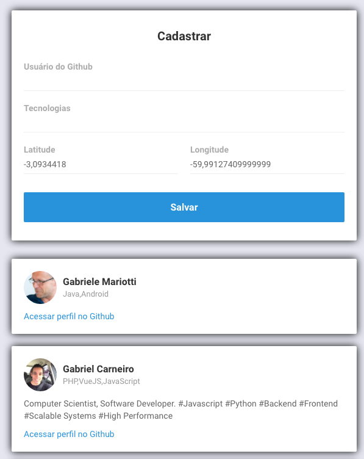
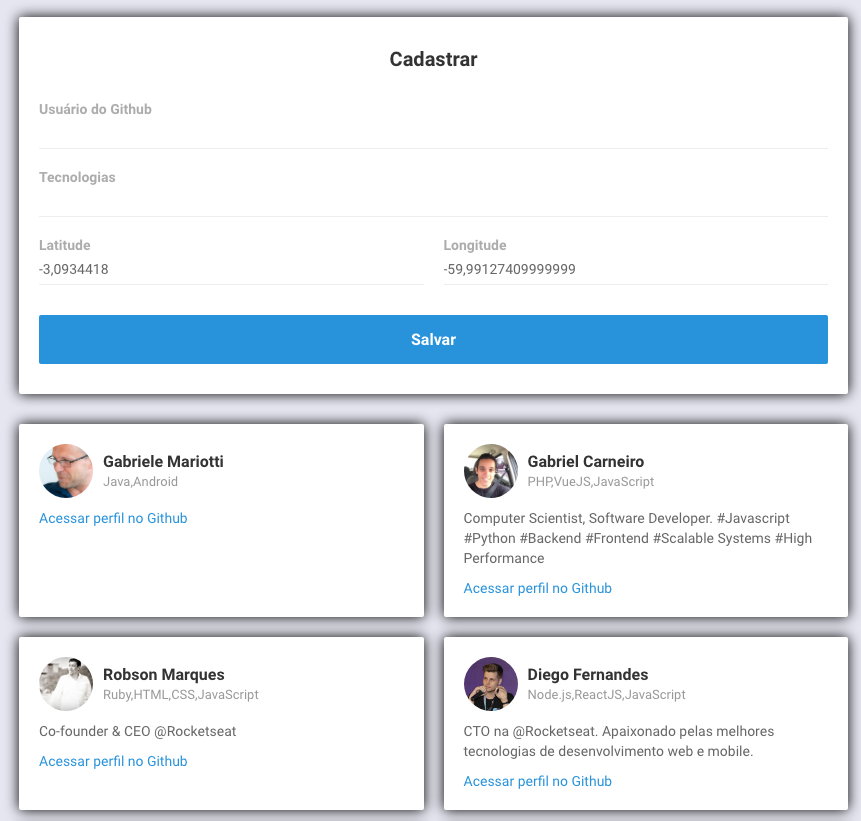

# Front-end ReactJS
"O React é uma biblioteca JavaScript de código aberto com foco em criar interfaces de usuário em páginas web. É mantido pelo Facebook, Instagram, outras empresas e uma comunidade de desenvolvedores individuais. É utilizado nos sites da Netflix, Imgur, Feedly, Airbnb, SeatGeek, HelloSign, Walmart e outros." - Wikipédia

Essa aplicaçáo web foi construida através de um script, próprio do React, com o propósito de deixar o sistema pronto para uso, automaticamente sao instaladas bibliotecas, mas especificamente nesse projeto, tive que usar o Axios para consumir os dados da API que criei no módulo back-end.

## Responsivo 
Este sistema web é RESPONSIVO! ou seja, se adequada em diferente tamanhos de telas. 
Telas pequenas 
Telas médias 
Telas grandes 
